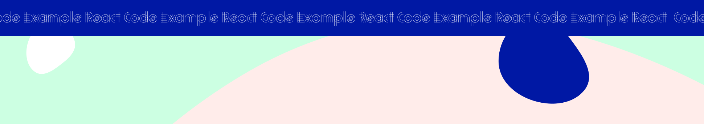

 

# Vite + React Code Example

## Getting Started

1.  Clone the repository to your local machine.
2.  Install the required dependencies using `npm install`.
3.  Start the development server using `npm run dev`.
